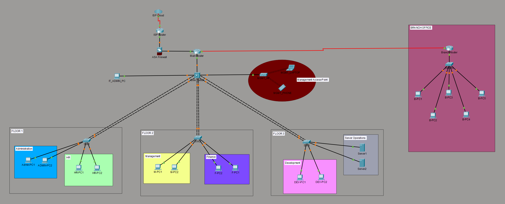

# Cisco Enterprise Network Design

## Project Overview
This project demonstrates the design and implementation of an enterprise-level network infrastructure using Cisco Packet Tracer. The project was developed to strengthen practical knowledge in enterprise networking, routing, switching, VLAN segmentation, and network security concepts.

## Technologies & Concepts Used
- Cisco Packet Tracer
- VLAN Configuration
- Inter-VLAN Routing
- Static Routing
- Dynamic Routing (RIPv2, OSPF Single Area, OSPF Multi Area, EIGRP)
- Access Control Lists (ACL)
- EtherChannel
- NAT & PAT
- SSH & Telnet
- TCP/IP Networking
- Subnetting & VLSM
- Network Security Concepts
- Enterprise Network Design

## Security Features
- Access Control List (ACL) Implementation
- VLAN Segmentation
- Router Password Security
- SSH Remote Access
- Secure Traffic Management

## Learning Outcomes
Through this project, I gained practical hands-on experience in:
- Enterprise Network Infrastructure Design
- Routing & Switching
- Secure Network Configuration
- Network Troubleshooting
- Infrastructure Planning
- Enterprise Connectivity Optimization

## Network Diagram

## Author
**Mohammad Abiduzzaman**
